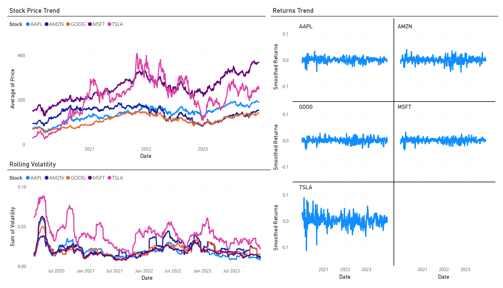
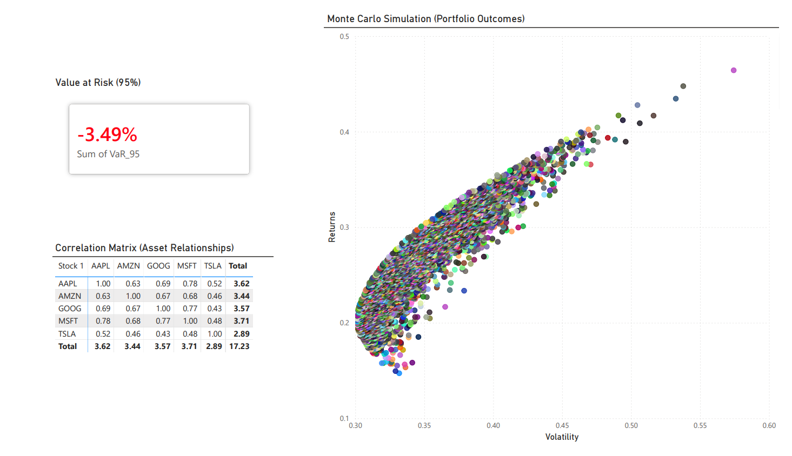

# 🚀 AlphaPulse – Portfolio Risk & Volatility Monitor

<p align="center">
  
</p>

---

## 📊 Overview

AlphaPulse is a **production-level financial analytics system** designed to:

* Analyze portfolio performance 📈
* Measure risk using statistical models ⚡
* Simulate future outcomes using Monte Carlo 💣
* Visualize insights via Power BI 🎯

---

## ✨ Highlights

* 📊 10,000+ Monte Carlo simulations
* ⚡ Real-time financial data pipeline
* 📉 Advanced risk modeling (VaR 95%)
* 🎯 Interactive Power BI dashboard

---

## 💡 Business Impact

AlphaPulse enables:

* 📊 Data-driven portfolio decision making
* ⚡ Early detection of high-risk assets
* 🔍 Improved diversification using correlation insights
* 💣 Quantification of downside risk using VaR

---

## 🧠 Use Case

An asset management firm requires:

* Real-time risk monitoring
* Portfolio exposure analysis
* Value at Risk (VaR) computation
* Correlation-based diversification insights

---

## ⚙️ Tech Stack

<p align="center">


</p>

---

## 🌐 Data Source

* Data fetched using **Yahoo Finance API (yfinance)**
* Historical time-series stock data
* Stocks used:

  * AAPL, MSFT, GOOG, TSLA, AMZN
* Ensures real-world, dynamic data pipeline

---

## 🔄 System Pipeline

<p align="center">
  
</p>

### 🔍 Pipeline Explanation

1. Data fetched from Yahoo Finance API
2. Cleaned and preprocessed
3. Feature engineering (returns, volatility, correlation)
4. Monte Carlo simulation for future scenarios
5. Value at Risk (VaR) calculation
6. Insights visualized in Power BI

---

## 📈 Core Features

### 📊 Performance Analysis

* Stock Price Trends
* Daily Log Returns
* Portfolio Performance

---

### ⚡ Risk Metrics

* Rolling Volatility (30-Day)
* Correlation Matrix
* Portfolio Risk

---

### 💣 Advanced Modeling

* Monte Carlo Simulation (10,000+ runs)
* Risk-return distribution
* Scenario-based portfolio outcomes

---

### 🚨 Value at Risk (VaR)

* 95% Confidence Level
* Quantifies potential losses
* Critical risk management metric

---

## 📊 Dashboard Preview

<p align="center">
  
  
</p>

---

## 📅 Project Timeline

| Week   | Focus            | Key Work               |
| ------ | ---------------- | ---------------------- |
| Week 1 | Data Acquisition | API + Cleaning         |
| Week 2 | Analysis         | Returns, Volatility    |
| Week 3 | Modeling         | Monte Carlo, VaR       |
| Week 4 | Dashboard        | Power BI Visualization |

---

## 🧪 Key Concepts

* Log Returns
* Covariance Matrix
* Portfolio Variance
* Monte Carlo Simulation
* Risk-Return Tradeoff

---

## 🗄️ SQL Analysis

* Window Functions (LAG, RANK)
* Moving Averages
* Time-series queries

---

## 🚀 Why This Project Stands Out

* End-to-end pipeline (Data → Analysis → Simulation → BI)
* Combines Finance + Data Science + Visualization
* Implements advanced concepts like Monte Carlo & VaR
* Based on real-world production use case

---

## ▶️ How to Run

### 1. Install dependencies

```bash
pip install -r requirements.txt
```

### 2. Run pipeline

```bash
python main.py
```

### 3. Open Power BI dashboard

* Load generated CSV files
* Explore insights interactively

---

## 📁 Project Structure

```
AlphaPulse-Portfolio-Risk-Monitor/
│
├── data/
├── notebooks/
├── src/
├── dashboard/
├── sql/
├── presentation/
├── main.py
└── README.md
```

---

## 🚀 Key Insights

* High volatility = higher risk ⚠️
* Correlation enables diversification 🔗
* Monte Carlo reveals uncertainty 📉
* VaR quantifies downside risk 💣

---

## 🔮 Future Scope

* Real-time streaming data
* Machine Learning predictions
* Cloud deployment (AWS/GCP)
* Portfolio optimization (Sharpe Ratio)

---

## 👩‍💻 Author

**Riddhima**
B.Tech CSE (Data Science)
Aspiring Data Analyst / ML Engineer

---

<p align="center">
✨ Built with Data • Driven by Insights • Powered by Python ✨
</p>
